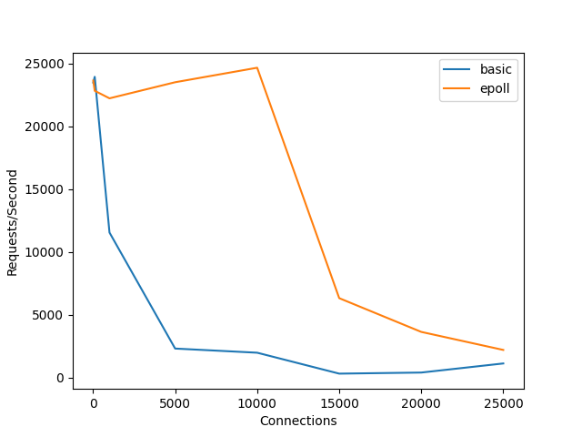

# Setup

Setup 2 containers:
- basic webserver
- epoll webserver

# Execution

To reproduce our results run 

```
./reproduce
```

this will do:
- startup basic http server
- startup epoll http server
- benchmark basic service
- benchmark epoll service
- generate combined plot for both benchmarks
- stop services

you can find all the  generated results in ./results:

- connections.txt 		list of connection counts for benchmark
- data-18080.txt  		basic benchmark results	
- data-18081.txt		epoll benchmark results
- plot-[timestamp].png 		plot generated at [timestamp]


# Plot


